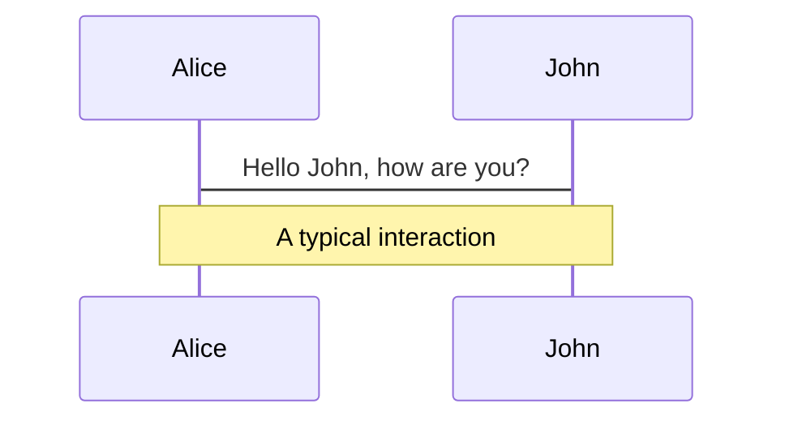
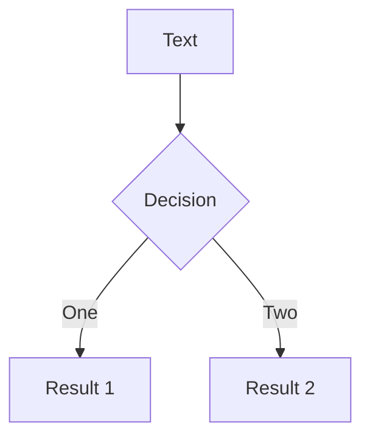

---
# try also 'default' to start simple
theme: default
# random image from a curated Unsplash collection by Anthony
# like them? see https://unsplash.com/collections/94734566/slidev
background: https://images.unsplash.com/photo-1525182008055-f88b95ff7980?crop=entropy&cs=tinysrgb&fit=max&fm=jpg&ixid=MXwxfDB8MXxhbGx8fHx8fHx8fA&ixlib=rb-1.2.1&q=80&w=1080&utm_source=unsplash_source&utm_medium=referral&utm_campaign=api-credit
# apply any windi css classes to the current slide
class: "text-center"
# https://sli.dev/custom/highlighters.html
highlighter: shiki
# show line numbers in code blocks
lineNumbers: false
# some information about the slides, markdown enabled
info: |
    ## Slidev Starter Template
    Presentation slides for developers.

    Learn more at [Sli.dev](https://sli.dev)
# persist drawings in exports and build
drawings:
    persist: false
---

# Bank Telemarketing Analysis

A Data-Driven Approach to Predict the Success of Bank Telemarketing.

<div class="pt-12">
  <span @click="$slidev.nav.next" class="px-2 py-1 rounded cursor-pointer" hover="bg-white bg-opacity-10">
    Press Space for next page <carbon:arrow-right class="inline"/>
  </span>
</div>

<!-- <div class="abs-br m-6 flex gap-2">
  <button @click="$slidev.nav.openInEditor()" title="Open in Editor" class="text-xl icon-btn opacity-50 !border-none !hover:text-white">
    <carbon:edit />
  </button>
  <a href="https://github.com/slidevjs/slidev" target="_blank" alt="GitHub"
    class="text-xl icon-btn opacity-50 !border-none !hover:text-white">
    <carbon-logo-github />
  </a>
</div> -->

<!--
The last comment block of each slide will be treated as slide notes. It will be visible and editable in Presenter Mode along with the slide. [Read more in the docs](https://sli.dev/guide/syntax.html#notes)
-->

---

<div
  v-if="$slidev.nav.currentPage === 2"
  v-motion
  :initial="{ x: 80 }"
  :enter="{ x: 0 }">
  <h1>Tentang Data</h1>
</div>
<ul>
    <li>Berasal dari sebuah paper berjudul "A data-driven approach to predict the success of bank telemarketing"</li>
    <li>Penelitian dilakukan di Portugal dan dipublish pada tahun 2014</li>
</ul>

<br>
<br>
<br>
<br>
<br>

<div
  v-if="$slidev.nav.currentPage === 2"
  v-motion
  :initial="{ x: 80 }"
  :enter="{ x: 0 }">
  <h1>Tujuan</h1>
</div>
<ul>
    <li>Pemodelan Machine Learning bertujuan untuk memprediksi <br> apakah customer akan <em>subscribe</em> produk deposito</li>
</ul>

<!--
You can have `style` tag in markdown to override the style for the current page.
Learn more: https://sli.dev/guide/syntax#embedded-styles
-->

<style>
h1 {
  background-color: #2B90B6;
  background-image: linear-gradient(45deg, #4EC5D4 10%, #146b8c 20%);
  background-size: 100%;
  -webkit-background-clip: text;
  -moz-background-clip: text;
  -webkit-text-fill-color: transparent; 
  -moz-text-fill-color: transparent;
}
</style>

---

<div
  v-if="$slidev.nav.currentPage === 3"
  v-motion
  :initial="{ x: 80 }"
  :enter="{ x: 0 }">
  <h1>Data Features (1)</h1>
</div>

<!-- Hover on the bottom-left corner to see the navigation's controls panel, [learn more](https://sli.dev/guide/navigation.html)

### Keyboard Shortcuts -->

| Client Data                                                         | Last Contact                                  |
| ------------------------------------------------------------------- | --------------------------------------------- |
| Age 🔢                                                              | Contact 🔠 <small>cellular, telephone</small> |
| Job 🔠 <small>6 values</small>                                      | Month 🔠 <small>Jan ... Dec</small>           |
| Marital 🔠 <small>divorced, married, single</small>                 | Day of Week 🔠 <small>Mon ... Fri</small>     |
| Education 🔠 <small>8 values</small>                                | Duration 🔢💡                                 |
| Default 🔠 <small>has credit in default? (no, yes, unknown)</small> |                                               |
| Housing Loan 🔠 <small>no, yes, unknown</small>                          |                                               |
| Personal Loan 🔠 <small>no, yes, unknown</small>                             |                                               |

```
💡 Important note: this attribute highly affects the output target (e.g., if duration=0 then y='no').
Yet, the duration is not known before a call is performed. Also, after the end of the call y is obviously known.
Thus, this input should only be included for benchmark purposes and should be discarded if the intention is
to have a realistic predictive model.
```

<!-- https://sli.dev/guide/animations.html#click-animations -->
<!-- 
<p v-after class="absolute bottom-23 left-45 opacity-30 transform -rotate-10">Here!</p> -->

<style>
  h1 {
    background-color: #2B90B6;
    background-image: linear-gradient(45deg, #4EC5D4 10%, #146b8c 20%);
    background-size: 100%;
    -webkit-background-clip: text;
    -moz-background-clip: text;
    -webkit-text-fill-color: transparent; 
    -moz-text-fill-color: transparent;
  }
</style>

---

<div
  v-if="$slidev.nav.currentPage === 4"
  v-motion
  :initial="{ x: 80 }"
  :enter="{ x: 0 }">
  <h1>Data Features (2)</h1>
</div>

| Other <br> Attributes                                     | Social and Economic <br> Context Attributes |
| --------------------------------------------------------- | ------------------------------------------- |
| Campaign 🔢                                               | emp.var.rate 🔢 <small>quarterly</small>    |
| P-days 🔢                                                 | cons.price.idx 🔢 <small>monthly</small>    |
| Previous 🔢                                               | cons.conf.idx 🔢 <small>monthly</small>     |
| P-outcome 🔠 <small>failure, nonexistent, success</small> | euribor3m 🔢 <small>daily</small>           |
|                                                           | nr.employed 🔢 <small>quarterly</small>     |

<style>
  h1 {
    background-color: #2B90B6;
    background-image: linear-gradient(45deg, #4EC5D4 10%, #146b8c 20%);
    background-size: 100%;
    -webkit-background-clip: text;
    -moz-background-clip: text;
    -webkit-text-fill-color: transparent; 
    -moz-text-fill-color: transparent;
  }
</style>

---
layout: two-cols

---

<div
  v-if="$slidev.nav.currentPage === 5"
  v-motion
  :initial="{ x: 80 }"
  :enter="{ x: 0 }">
  <h1>Target</h1>
</div>

- Subscribe to term deposit?
- y = (yes/no)

::right::

<br>
<br>
<br>
<br>
<br>


<style>
  h1 {
    background-color: #2B90B6;
    background-image: linear-gradient(45deg, #4EC5D4 10%, #146b8c 20%);
    background-size: 100%;
    -webkit-background-clip: text;
    -moz-background-clip: text;
    -webkit-text-fill-color: transparent; 
    -moz-text-fill-color: transparent;
  }
</style>

---
layout: two-cols

---
<div
  v-if="$slidev.nav.currentPage === 6"
  v-motion
  :initial="{ x: 80 }"
  :enter="{ x: 0 }">
  <h1>Analisis Deskriptif</h1>
</div>

```python {all|1-4|1-9|all}
def plot_graphs(col, df):
    # Set Figsize
    len_values = len(df[col].value_counts()) if len(df[col].value_counts()) > 5 else 5
    fig, ax = plt.subplots(2, sharex=True, figsize=(len_values, 15))

    # Plot Histogram
    sns.histplot(data=df, x=col, ax=ax[0])
    ax[0].set_title(f"{col.title()} Histogram")
    ax[1].set_title(f"y distribution on {col.title()}")

    # Plot y distribution on feature
    Y = df[col]
    total = len(Y)
    sns.countplot(x=col, data=df, hue="y")
    for i, p in enumerate(ax[1].patches):
        percent = (p.get_height() / total) * 100
        ax[1].annotate(f'{percent:.2f}%', (p.get_x()+0.1, p.get_height()+5))

    ax[1].set_yticklabels(map('{:.1f}%'.format, 100*ax[1].yaxis.get_majorticklocs()/total))
    ax[1].set_xticklabels(ax[1].get_xticklabels(), rotation=40, ha="right")
    plt.show()
```

::right::

#### Data Type: Categorical

###### 1. Job

<!--  -->

<style>
  h1 {
    background-color: #2B90B6;
    background-image: linear-gradient(45deg, #4EC5D4 10%, #146b8c 20%);
    background-size: 100%;
    -webkit-background-clip: text;
    -moz-background-clip: text;
    -webkit-text-fill-color: transparent; 
    -moz-text-fill-color: transparent;
  }
</style>

---
layout: two-cols

---
#### Data Type: Categorical

###### 2. Marital Status


::right::
#### ___
###### 3. Education


---
layout: two-cols

---
#### Data Type: Categorical

###### 4. Default


::right::
#### ___
###### 5. housing Loan


---
layout: two-cols

---
#### Data Type: Categorical

###### 6. Personal Loan


::right::
#### ___
###### 7. Contact


---
layout: two-cols

---
#### Data Type: Categorical

###### 8. Month


::right::
#### ___
###### 9. Day of Week


---
layout: two-cols

---
#### Data Type: Categorical

###### 10. P-outcome


::right::

---
layout: image-right
image: https://source.unsplash.com/collection/94734566/1920x1080

---

# Code

Use code snippets and get the highlighting directly![^1]

```ts {all|2|1-6|9|all}
interface User {
    id: number;
    firstName: string;
    lastName: string;
    role: string;
}

function updateUser(id: number, update: User) {
    const user = getUser(id);
    const newUser = { ...user, ...update };
    saveUser(id, newUser);
}
```

<arrow v-click="3" x1="400" y1="420" x2="230" y2="330" color="#564" width="3" arrowSize="1" />

[^1]: [Learn More](https://sli.dev/guide/syntax.html#line-highlighting)

<style>
.footnotes-sep {
  @apply mt-20 opacity-10;
}
.footnotes {
  @apply text-sm opacity-75;
}
.footnote-backref {
  display: none;
}
</style>

---

# Components

<div grid="~ cols-2 gap-4">
<div>

You can use Vue components directly inside your slides.

We have provided a few built-in components like `<Tweet/>` and `<Youtube/>` that you can use directly. And adding your custom components is also super easy.

```html
<Counter :count="10" />
```

<!-- ./components/Counter.vue -->
<Counter :count="10" m="t-4" />

Check out [the guides](https://sli.dev/builtin/components.html) for more.

</div>
<div>

```html
<Tweet id="1390115482657726468" />
```

<Tweet id="1390115482657726468" scale="0.65" />

</div>
</div>

---

## class: px-20

# Themes

Slidev comes with powerful theming support. Themes can provide styles, layouts, components, or even configurations for tools. Switching between themes by just **one edit** in your frontmatter:

<div grid="~ cols-2 gap-2" m="-t-2">

```yaml
---
theme: default
---
```

```yaml
---
theme: seriph
---
```


</div>

Read more about [How to use a theme](https://sli.dev/themes/use.html) and
check out the [Awesome Themes Gallery](https://sli.dev/themes/gallery.html).

---

## preload: false

# Animations

Animations are powered by [@vueuse/motion](https://motion.vueuse.org/).

```html
<div v-motion :initial="{ x: -80 }" :enter="{ x: 0 }">Slidev</div>
```

<div class="w-60 relative mt-6">
  <div class="relative w-40 h-40">
    
    
    
  </div>

  <div 
    class="text-5xl absolute top-14 left-40 text-[#2B90B6] -z-1"
    v-motion
    :initial="{ x: -80, opacity: 0}"
    :enter="{ x: 0, opacity: 1, transition: { delay: 2000, duration: 1000 } }">
    Slidev
  </div>
</div>

<!-- vue script setup scripts can be directly used in markdown, and will only affects current page -->
<script setup lang="ts">
const final = {
  x: 0,
  y: 0,
  rotate: 0,
  scale: 1,
  transition: {
    type: 'spring',
    damping: 10,
    stiffness: 20,
    mass: 2
  }
}
</script>

<div
  v-motion
  :initial="{ x:35, y: 40, opacity: 0}"
  :enter="{ y: 0, opacity: 1, transition: { delay: 3500 } }">

[Learn More](https://sli.dev/guide/animations.html#motion)

</div>

---

# LaTeX

LaTeX is supported out-of-box powered by [KaTeX](https://katex.org/).

<br>

Inline $\sqrt{3x-1}+(1+x)^2$

Block

$$
\begin{array}{c}

\nabla \times \vec{\mathbf{B}} -\, \frac1c\, \frac{\partial\vec{\mathbf{E}}}{\partial t} &
= \frac{4\pi}{c}\vec{\mathbf{j}}    \nabla \cdot \vec{\mathbf{E}} & = 4 \pi \rho \\

\nabla \times \vec{\mathbf{E}}\, +\, \frac1c\, \frac{\partial\vec{\mathbf{B}}}{\partial t} & = \vec{\mathbf{0}} \\

\nabla \cdot \vec{\mathbf{B}} & = 0

\end{array}
$$

<br>

[Learn more](https://sli.dev/guide/syntax#latex)

---

# Diagrams

You can create diagrams / graphs from textual descriptions, directly in your Markdown.

<div class="grid grid-cols-2 gap-10 pt-4 -mb-6">





</div>

[Learn More](https://sli.dev/guide/syntax.html#diagrams)

---

layout: center
class: text-center

---

# Learn More

[Documentations](https://sli.dev) · [GitHub](https://github.com/slidevjs/slidev) · [Showcases](https://sli.dev/showcases.html)
